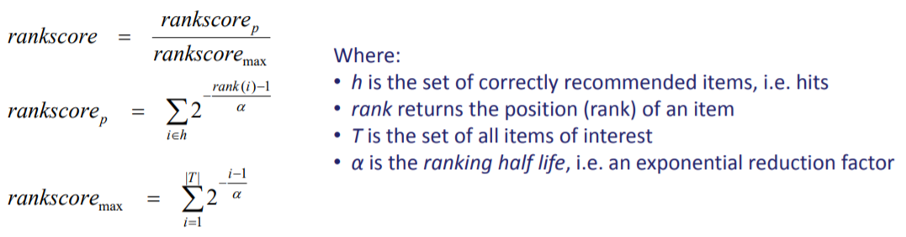

# 순위 예측 평가 방법

## Rank 추정

* 추천\(recommendation\)의 특성 상, instance별로 정확한 확률을 예측하는 것보다 순위\(rank\)을 매기는 것이 더 중요한 경우가 있다. 데이터와 분석 목적에 따라 평가 기준을 확률로 할 것인지, 순위로 할 것인지 잘 결정해야 한다.
* 확률을 추정해야 하는 경우 : 광고비를 지불하고 광고하는 경우, 가격 결정해야 하는 경우, 모바일 광고
* 순위를 추정해야 하는 경우 : 자료가 skewed 되어 있는\(outlier가 존재하는\) 경우 
* 순위 추정의 경우, 실제로 좋아하는 상품의 추천된 순위가 높을 수록 추천 시스템의 성능이 좋다고 판단한다.

## Rank Score

## References

* [Recommender systems - UCI Math](https://www.math.uci.edu/icamp/courses/math77b/lecture_12w/pdfs/Chapter%2007%20-%20Evaluating%20recommender%20systems.pdf)

