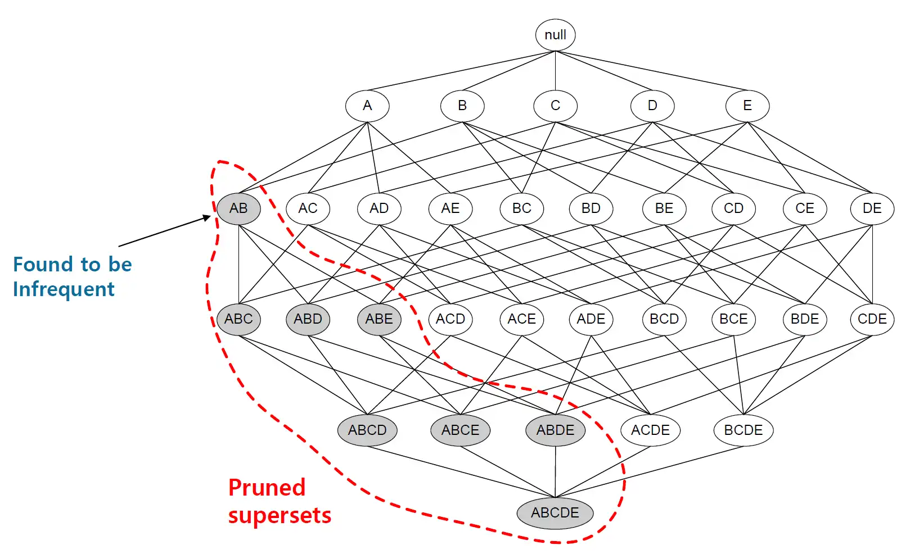

# A priori Algorithm

## 연관규칙분석\(A priori algorithm\)

* 연관규칙분석이란 **어떤 두 아이템 집합이 얼마나 빈번히 발생하는가를 알려주는 일련의 규칙**들을 생성하는 알고리즘이다.
* 경영학에선 **장바구니 분석\(Market Basket Analysis\)**으로 널리 알려져 있다.
* 연관규칙분석을 통해 소비자들의 구매이력 데이터를 토대로 "A 아이템을 구매하는 고객들은 B 아이템 역시 구매할 가능성이 높다"는 식의 결론을 내릴 수 있다.
* 인터넷 쇼핑을 할 때 어떤 상품을 고르면, 그 상품을 구매한 사람들이 선택한 다른 상품을 제안해주는 식의 컨텐츠 기반 추천\(Contents-based recommendation\)의 기본이 되는 방법론이다.

### 연관성 분석과 연관규칙 분석의 차이점

* 연관성 분석은 가능한 모든 경우의 수를 고려하여 규칙을 생성하고
* 연관규칙 분석\(A priori algorithm\)은 **빈발 집합\(frequent item sets\)만을 고려하여 규칙을 생성**한다.

### 초월집합\(Superset\)

예를 들어, 아이템 집합 {A}의 지지도 즉, P\(A\)가 0.1이라고 가정해보자. 그렇다면 {A, B}의 지지도와 {A, B, C}의 지지도는 아무리 높아도 0.1을 넘지 못할 것이다. 왜냐하면, 전체 경우의 수에서 {A}가 등장한 수보다 {A, B} 또는 {A, B, C}가 등장한 수가 더 많을 수가 없기 때문이다. 다시 말하면, {A}는 {A, B}와 {A, B, C}의 부분집합이고, P\(A\)는 P\(A, B\), P\(A, B, C\)보다는 크거나 같을 것이기 때문이다. 이럴 때, {A}는 {A,B}, {A, B, C}의 초월집합\(Superset\)이라고 부른다.

{A, B}가 일정 지지도를 넘지 못했다면, 이 집합의 부분집합의 지지도도 그 기준을 넘지 못할 것이다. 이러한 집합들의 규칙들은 유용한 규칙으로 인정받을 수 없고, 계산할 필요도 없게 된다. 따라서 위와 같이 {A, B}를 포함하여 {A, B, C}, {A, B, D} 등 8가지의 부분집합들은 모두 계산에서 제외된다. 이를 통해 계산의 효율성을 달성할 수 있다.

연관규칙분석\(A priori alogrithm\)의 방법은 일정 지지도를 넘지 못하는 아이템 집합을 계산에서 제외한다는 점만 빼면 모두 동일하다. 따라서 분석 예시는 따로 적지 않았다.

## References

* [Ratsgo's blog](https://ratsgo.github.io/machine%20learning/2017/04/08/apriori/): 이미지 및 글

  

